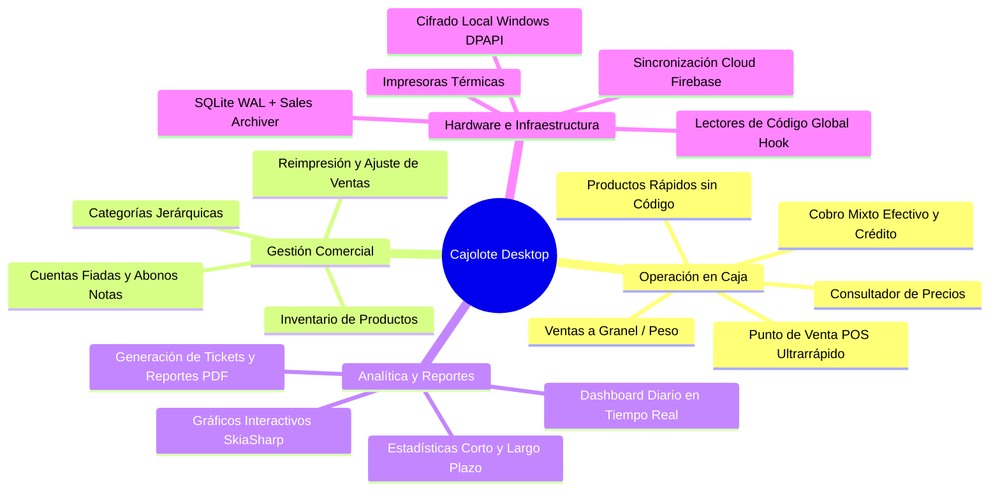
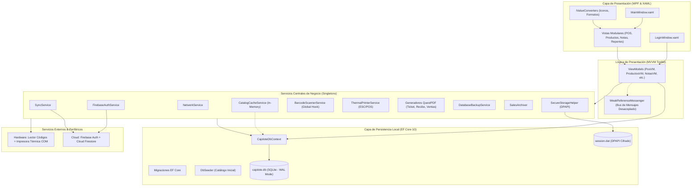
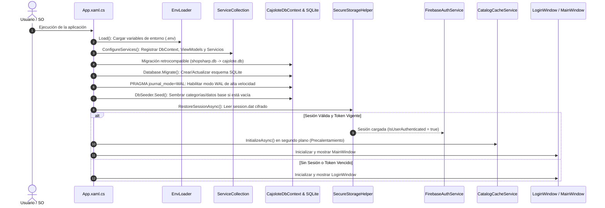
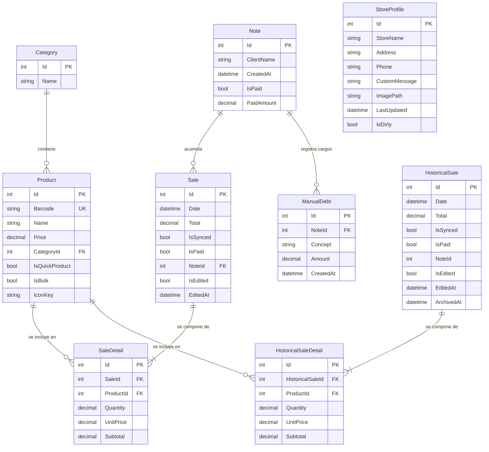

# 🥑 Cajolote Desktop — Showcase del Proyecto

> **Sistema Integral de Punto de Venta (POS), Inventario, Control de Créditos y Analítica Comercial para Windows con Arquitectura Offline-First y Sincronización Cloud.**

---

## 📌 Tabla de Contenidos

1. [Visión General del Proyecto](#-visión-general-del-proyecto)
2. [Propuesta de Valor y Principios de Diseño](#-propuesta-de-valor-y-principios-de-diseño)
3. [Stack Tecnológico y Dependencias](#-stack-tecnológico-y-dependencias)
4. [Arquitectura de Software](#-arquitectura-de-software)
   - [Patrón Arquitectónico MVVM](#patrón-arquitectónico-mvvm)
   - [Diagrama de Arquitectura de Capas](#diagrama-de-arquitectura-de-capas)
   - [Flujo del Ciclo de Vida y Arranque](#flujo-del-ciclo-de-vida-y-arranque)
5. [Módulos y Catálogo Exhaustivo de Funcionalidades](#-módulos-y-catálogo-exhaustivo-de-funcionalidades)
   - [1. Autenticación y Control de Acceso](#1-autenticación-y-control-de-acceso-loginwindow)
   - [2. Ventana Maestra y Navegación](#2-ventana-maestra-y-navegación-mainwindow)
   - [3. Punto de Venta Ágil (POS)](#3-punto-de-venta-ágil-pos-posview)
   - [4. Consultador Rápido de Precios](#4-consultador-rápido-de-precios-revisarprecioview)
   - [5. Gestión de Catálogo e Inventario](#5-gestión-de-catálogo-e-inventario-productosview)
   - [6. Ventas Recientes y Modificaciones](#6-ventas-recientes-y-modificaciones-recientesview)
   - [7. Historial y Registros Consolidados](#7-historial-y-registros-consolidados-registrosview)
   - [8. Control de Créditos y Cuentas Fiadas (Notas)](#8-control-de-créditos-y-cuentas-fiadas-notas-notasview)
   - [9. Dashboards y Analítica Comercial](#9-dashboards-y-analítica-comercial)
   - [10. Identidad del Negocio y Recorte de Logotipo](#10-identidad-del-negocio-y-recorte-de-logotipo-perfilview)
   - [11. Configuración de Hardware y Sistema](#11-configuración-de-hardware-y-sistema-configuracionview)
6. [Integración con Hardware Periférico](#-integración-con-hardware-periférico)
7. [Modelo y Diccionario de Datos](#-modelo-y-diccionario-de-datos)
   - [Diagrama Entidad-Relación (ER)](#diagrama-entidad-relación-er)
   - [Esquema de Tablas SQLite](#esquema-de-tablas-sqlite)
   - [Seguridad y Almacenamiento Cifrado (DPAPI)](#seguridad-y-almacenamiento-cifrado-dpapi)
8. [Estrategias de Rendimiento y Resiliencia](#-estrategias-de-rendimiento-y-resiliencia)
9. [Estructura del Código Fuente](#-estructura-del-código-fuente)
10. [Requisitos del Sistema, Instalación y Despliegue](#-requisitos-del-sistema-instalación-y-despliegue)

---

## 📖 Visión General del Proyecto

**Cajolote Desktop** es una aplicación de escritorio de alto rendimiento diseñada específicamente para satisfacer las necesidades operativas de pequeños y medianos comercios minoristas, abarrotes, cremerías y tiendas de conveniencia.

Desarrollada sobre la plataforma **.NET 10.0** y **Windows Presentation Foundation (WPF)**, la aplicación combina una estética visual moderna basada en **Material Design** con un motor de datos local transaccional **SQLite** operando bajo el paradigma **Offline-First**. Esto garantiza que el cajero pueda procesar cobros, consultar precios y gestionar transacciones a latencia prácticamente nula, con total independencia del estado de la conexión a internet, incorporando sincronización en segundo plano con **Google Firebase** cuando hay conectividad disponible.



---

## 🎯 Propuesta de Valor y Principios de Diseño

* **Operatividad Ininterrumpida (100% Offline-First):** La base de datos local SQLite con registro de escritura por anticipado (`WAL mode`) permite que el comercio nunca detenga sus ventas ante fallas de red o caídas de internet.
* **Velocidad Extrema en el Mostrador:** Integración de un gancho de teclado a nivel de sistema operativo para capturar códigos de barras en milisegundos sin requerir que el cursor esté situado en un campo de texto específico.
* **Flexibilidad Comercial:** Soporte nativo para artículos tradicionales a granel (venta por peso en kilogramos con precisión de tres decimales) y artículos sin código de barras (bolillos, verduras, etc.) a través de botones de acceso rápido.
* **Gestión de Confianza ("Fiado"):** Módulo integral de cuentas por cobrar para registrar clientes, asignarles compras fiadas, asentar cargos manuales y registrar abonos parciales con comprobantes impresos al momento.
* **Optimización Continua de Recursos:** Mantenimiento automático del tamaño y rendimiento de la base de datos local mediante archivado periódico de ventas históricas, evitando la degradación con el paso de los años.

---

## 🛠️ Stack Tecnológico y Dependencias

| Capa / Componente | Tecnología | Versión | Rol en el Sistema |
| :--- | :--- | :--- | :--- |
| **Framework Base** | [.NET SDK](https://dotnet.microsoft.com/) | `10.0-windows` | Núcleo de ejecución, compilación C# y runtime nativo de alto rendimiento. |
| **Motor Gráfico (UI)** | [WPF](https://learn.microsoft.com/dotnet/desktop/wpf/) | Windows Desktop | Interfaz gráfica nativa con aceleración por hardware DirectX. |
| **Patrón MVVM** | `CommunityToolkit.Mvvm` | `8.4.2` | Implementación de `ObservableObject`, `RelayCommand` y `WeakReferenceMessenger`. |
| **Diseño Visual** | `MaterialDesignThemes` | `5.3.2` | Componentes visuales modernos, sombras elevadas, tipografía y paletas temáticas. |
| **Visualización de Datos** | `LiveChartsCore.SkiaSharpView.WPF` | `2.0.2` | Gráficas interactivas fluidas (líneas, pastel/donas y barras) renderizadas con SkiaSharp. |
| **Animaciones UI** | `LottieSharp` | `2.4.3` | Renderizado vectorial de animaciones fluidas (pantallas de espera, confirmaciones). |
| **Base de Datos Local** | [SQLite](https://www.sqlite.org/) | 3.x | Base de datos embebida transaccional, ultraligera y sin configuración de servidor. |
| **Mapeador ORM** | `Microsoft.EntityFrameworkCore.Sqlite` | `10.0.0` | Abstracción de acceso a datos, migraciones automáticas y consultas LINQ tipadas. |
| **Inyección de Dependencias** | `Microsoft.Extensions.DependencyInjection` | `10.0.8` | Contenedor de inversión de control (IoC) y ciclo de vida de servicios singleton/transient. |
| **Generación de Documentos** | [QuestPDF](https://www.questpdf.com/) | `2026.5.0` | Maquetación fluida y generación vectorial de comprobantes, tickets y reportes PDF. |
| **Comunicación Serial** | `System.IO.Ports` | `10.0.8` | Control directo de puertos COM físicos/virtuales para impresoras térmicas ESC/POS. |
| **Autenticación en la Nube** | `FirebaseAuthentication.net` | `4.1.0` | Autenticación de usuarios vía tokens JWT contra Firebase Auth. |
| **Sincronización Cloud** | Cloud Firestore REST Client | REST API | Sincronización híbrida segura de transacciones, catálogo y perfil en segundo plano. |
| **Seguridad Local** | Windows DPAPI | Nativo Windows | Cifrado a nivel de usuario en disco para llaves de sesión y tokens de acceso. |

---

## 🏗️ Arquitectura de Software

### Patrón Arquitectónico MVVM

Cajolote implementa una estricta separación de responsabilidades a través del patrón **Model-View-ViewModel (MVVM)**, orquestado mediante el framework oficial **CommunityToolkit.Mvvm**:

* **Views (Vistas):** Archivos `.xaml` con mínimo code-behind, dedicados exclusivamente al binding de controles, plantillas visuales y transiciones de interfaz.
* **ViewModels:** Clases que heredan de `ObservableObject`. Exponen propiedades reactivas `[ObservableProperty]`, encapsulan la lógica de presentación con `[RelayCommand]` y se comunican de forma desacoplada con el bus de eventos `WeakReferenceMessenger`.
* **Models (Dominio):** Entidades POCO que representan las tablas de SQLite y las estructuras de negocio (`Product`, `Sale`, `Note`, etc.).
* **Services (Lógica de Negocio):** Componentes registrados como Singletons en el contenedor de dependencias que resuelven tareas especializadas (impresión, escaneo, respaldo, cifrado, sincronización).

---

### Diagrama de Arquitectura de Capas



---

### Flujo del Ciclo de Vida y Arranque

Al inicializarse la aplicación ([`App.xaml.cs`](file:///c:/CAJOLOTE/Cajolote_desktop/App.xaml.cs)), se ejecuta una secuencia controlada de arranque que garantiza la integridad estructural y la seguridad de los datos:



---

## 💻 Módulos y Catálogo Exhaustivo de Funcionalidades

### 1. Autenticación y Control de Acceso (`LoginWindow`)
* **Validación de Identidad Cloud:** Comprobación de credenciales (correo electrónico y contraseña) conectándose con el servicio de Firebase Authentication.
* **Registro de Nuevos Comercios:** Creación inmediata de nuevas cuentas de propietario en la nube desde la propia interfaz de escritorio.
* **Recuperación Automática de Contraseña:** Generación y despacho de correos de restablecimiento para usuarios con contraseñas olvidadas.
* **Persistencia Cifrada de Sesión:** Almacenamiento seguro del token de acceso JWT y datos de cuenta en disco local mediante la API nativa de protección de datos de Windows (DPAPI), evitando tener que iniciar sesión en cada apertura.

---

### 2. Ventana Maestra y Navegación (`MainWindow`)
* **Barra Lateral Reactiva:** Menú de navegación persistente con iconos claros y resaltado dinámico de la vista activa.
* **Escaneo Global de Código de Barras:** Intercepta ráfagas de entrada del escáner en cualquier parte de la ventana mediante un gancho global (`Attach(this)`), dirigiéndolas automáticamente al Punto de Venta o al Verificador de Precios según corresponda.
* **Monitor de Conectividad en Tiempo Real:** Detección de conectividad a internet (`NetworkService`) con alertas visuales y cambio cromático dinámico de indicadores de red.
* **Sincronización Automática en el Arranque:** Respalda la base de datos en segundo plano al iniciar.
* **Mantenimiento y Desfragmentación Silenciosa:** Invoca a `SalesArchiver` al inicio para mover ventas de meses previos a tablas históricas mientras muestra una pantalla de carga sutil con Lottie.
* **Atajos de Teclado Globales:** Navegación acelerada mediante combinaciones de teclas:
  * `Alt + 1`: Dashboard
  * `Alt + 2`: Punto de Venta (POS)
  * `Alt + 3`: Revisar Precio
  * `Alt + 4`: Catálogo de Productos
  * `Alt + 5`: Ventas Recientes
  * `Alt + 6`: Notas y Créditos
  * `Alt + 7`: Registro Histórico
  * `Alt + 8`: Estadísticas
  * `Alt + 9`: Perfil de la Tienda
  * `Alt + 0`: Configuración

---

### 3. Punto de Venta Ágil (POS) (`PosView`)
* **Entrada de Productos Multimodal:**
  * **Lector de Códigos de Barras:** Agregado instantáneo de artículos al carrito.
  * **Acceso a Productos Rápidos:** Panel con cuadrícula personalizable de artículos sin código físico (ej. bolillo, tortilla, huevo, verduras).
* **Gestión de Artículos a Granel (Peso):** Detección automática de artículos marcados como `IsBulk`, abriendo un teclado numérico interactivo para digitar la cantidad exacta o decimal en kilogramos (ej. `0.450 kg`).
* **Carrito de Ventas Reactivo:**
  * Modificación de cantidades unitarias mediante botones `+` y `-` o ingreso directo.
  * Edición rápida de precio unitario en el propio renglón de la venta para aplicar cambios de precio, descuentos o promociones en el acto.
  * Eliminación selectiva de renglones o vaciado integral de la orden.
* **Modalidades de Cobro:**
  * **Efectivo:** Calculadora automática de cambio con desglose de billetes recibidos e importe a devolver.
  * **Crédito / Cuenta Fiada:** Vinculación directa del importe de la venta a la nota de deuda de un cliente registrado.
* **Emisión de Tickets:** Impresión automática directa a impresoras térmicas y/o generación de tickets limpios en formato PDF estructurado mediante QuestPDF.

---

### 4. Consultador Rápido de Precios (`RevisarPrecioView`)
* **Pantalla de Verificación Inmediata:** Interfaz de tipografía prominente pensada para uso ágil por parte del cajero o como terminal de consulta para el cliente.
* **Información Desplegada:** Muestra el precio actual, nombre completo, código de barras, categoría asociada e icono gráfico del producto escaneado.
* **Acceso Directo a Edición:** Botón de un solo clic para saltar al formulario de modificación del catálogo si se detecta un precio desactualizado.

---

### 5. Gestión de Catálogo e Inventario (`ProductosView`)
* **Búsqueda Avanzada y Paginación Virtual:** Filtrado rápido por nombre, código de barras, rango de precio o categoría, con límites configurables para evitar congelamientos de interfaz con catálogos masivos.
* **Administración Completa de Productos (CRUD):**
  * Alta y edición de nombre, código de barras, precio unitario.
  * Vinculación a categorías existentes.
  * Activación de bandera `IsQuickProduct` (aparición en mostrador rápido).
  * Activación de bandera `IsBulk` (producto vendido por peso decimal).
  * Asignador visual de iconos temáticos para identificación gráfica rápida.
  * Eliminación segura de productos con confirmación de diálogo.
* **Gestión Jerárquica de Categorías (CRUD):**
  * Creación y renombrado rápido de categorías.
  * Eliminación protegida: validación de integridad referencial que previene el borrado accidental de categorías que tengan productos asociados.

---

### 6. Ventas Recientes y Modificaciones (`RecientesView`)
* **Auditoría de Ventas del Turno/Día:** Listado cronológico de las ventas efectuadas en la jornada actual, con detalles de estado de pago (liquidada o fiada) y bandera de sincronización.
* **Reimpresión de Comprobantes:** Capacidad de volver a imprimir tickets físicos o regenerar sus PDFs en cualquier momento.
* **Ajuste de Transacciones:** Herramienta para corregir renglones de una venta cerrada por error en mostrador, recalculando el total y dejando trazabilidad con la marca `IsEdited` y `EditedAt`.
* **Liquidación de Cuentas:** Marcado y cobro de ventas fiadas directamente desde la lista de ventas del día.

---

### 7. Historial y Registros Consolidados (`RegistrosView`)
* **Búsqueda Cronológica Extensa:** Filtros por rangos de fecha personalizados (desde un día particular hasta periodos bimestrales o anuales).
* **Unificación Transparente de Datos:** Consulta simultánea y sin fisuras tanto de la tabla de ventas activas (`Sales`) como del repositorio de ventas archivadas (`HistoricalSales`).
* **Generador de Informes de Ventas en PDF:** Despacho de reportes ejecutivos consolidados con sumatorias de ingresos, desglose de artículos vendidos y promedios operativos maquetados con QuestPDF.

---

### 8. Control de Créditos y Cuentas Fiadas ("Notas") (`NotasView`)
* **Libreta Digital de Cuentas por Cobrar:** Gestión de deudas de confianza organizadas por cliente.
* **Cuentas Activas y Saldadas:** Pestañas para distinguir deudores con saldo pendiente de clientes con notas liquidadas.
* **Desglose Exhaustivo de la Deuda:**
  * Relación de ventas cargadas a la nota con detalle de artículos consumidos.
  * Registro de cargos manuales (`ManualDebts`) para asentar préstamos directos de dinero en efectivo o ajustes de cuenta con su concepto y fecha.
* **Registro de Abonos en Tiempo Real:** Entrada de pagos parciales o totales que recalculan al instante el saldo restante de la nota.
* **Recibo Térmico y Digital de Abono:** Generación inmediata de recibos de pago de abono (`NoteReceiptGenerator`) para entregar al cliente como comprobante físico o digital.

---

### 9. Dashboards y Analítica Comercial
* **Tablero Ejecutivo Diario (`DashboardView`):**
  * **Tarjetas KPI:** Total de ventas acumuladas hoy ($), número de tickets cerrados, unidades de producto vendidas y monto promedio por transacción.
  * **Gráfica Horaria:** Curva de ingresos a lo largo de las horas del día para identificar las horas pico de tráfico.
  * **Distribución por Categorías:** Gráfica de pastel interactiva; al interactuar con una porción o su leyenda, el centro despliega en grande el nombre de la categoría, ingresos exactos y porcentaje relativo.
  * **Top de Artículos:** Gráfica de barras horizontales con los 5 productos con mayor demanda del día.
* **Estadísticas de Corto Plazo (`EstadisticasView`):** Análisis comparativo por días de la semana y semanas del mes.
* **Estadísticas Históricas y Macrotendencias (`EstadisticasTotalesView`):** Consolidación de ingresos acumulados a lo largo de meses y años, fusionando datos vigentes y archivados.

---

### 10. Identidad del Negocio y Recorte de Logotipo (`PerfilView`)
* **Personalización del Establecimiento:** Configuración de nombre comercial, domicilio y número de teléfono que aparece en los tickets.
* **Editor y Recortador Visual de Logotipo (`ImageCropWindow`):**
  * Ventana dedicada para cargar imágenes para el logo del negocio en formatos PNG o JPG (no se imprime en los tickets).
  * Lienzo de recorte y escalado interactivo para ajustar el encuadre exacto del logotipo.

---

### 11. Configuración de Hardware y Sistema (`ConfiguracionView`)
* **Calibración de Impresora Térmica:**
  * Detección y selección de impresoras vinculadas al dispositivo windows.
  * Botón de prueba de impresión con corte automático de papel.
* **Control de Base de Datos y Sincronización:**
  * Monitor del estado de enlace con Cloud Firestore.
  * Optimización de almacenamiento.

---

## 🔌 Integración con Hardware Periférico

### 1. Escáner de Código de Barras Global (`BarcodeScannerService`)
A diferencia de sistemas convencionales donde el cursor debe estar ubicado obligatoriamente en un `TextBox`, Cajolote implementa un gancho de eventos de teclado en la ventana principal (`PreviewTextInput` y temporizador de cadencia de caracteres).
* **Detección por Cadencia:** Identifica entradas que ocurren a una velocidad típica de un escáner láser/óptico (inferior a 35 milisegundos entre dígitos) finalizadas con un delimitador de retorno de carro (`Enter`).
* **Enrutamiento Inteligente:** Si la ventana activa es el Consultador de Precios, actualiza la tarjeta de consulta; si es el Punto de Venta, agrega el producto al carrito; si el usuario está en un campo de búsqueda común, respeta la digitación manual sin interferir.

### 2. Impresora Térmica de Recibos (`ThermalPrinterService`)
* **Protocolo ESC/POS Nativo:** Envío directo de bytes de control estándar mediante `System.IO.Ports.SerialPort`.
* **Comandos Implementados:**
  * Inicialización de cabezal (`ESC @`).
  * Alineación de texto: izquierda, centro y derecha (`ESC a n`).
  * Estilos tipográficos: negrita activada/desactivada (`ESC E n`), doble ancho y doble alto.
  * Avance de líneas (`LF` / `ESC d n`).
  * Comando de corte parcial o total de papel (`GS V 66 n`).
* **Modo Ticket Digital:** En ausencia de una impresora física conectada o configurada, el sistema genera de forma transparente el comprobante en formato vectorial PDF mediante `TicketGenerator`.

---

## 🗄️ Modelo y Diccionario de Datos

### Diagrama Entidad-Relación (ER)



---

### Esquema de Tablas SQLite

La base de datos se aloja en `%LocalAppData%\cajolote.db` y se gestiona íntegramente mediante **Entity Framework Core 10**:

1. **`Categories`**: Clasificación jerárquica del catálogo de productos.
2. **`Products`**: Catálogo de artículos disponibles para la venta. Dispone de un índice único sobre `Barcode` para búsquedas en tiempo $O(1)$.
3. **`Sales`**: Cabeceras de transacciones de venta activas (del mes corriente o deudas no liquidadas).
4. **`SaleDetails`**: Renglones detallados de productos vendidos por transacción con cantidades enteras o fraccionarias (`decimal(18,3)`).
5. **`HistoricalSales` & `HistoricalSaleDetails`**: Repositorio de ventas finalizadas de meses anteriores. Conservan los identificadores originales (`Id`) sin auto-incrementos que alteren la correlación.
6. **`Notes`**: Directorio de cuentas por cobrar o libretas de crédito por cliente, controlando el total acumulado y los abonos realizados (`PaidAmount`).
7. **`ManualDebts`**: Ajustes de saldo y préstamos monetarios registrados manualmente sobre la cuenta de un cliente.
8. **`StoreProfiles`**: Datos de personalización comercial e imagen institucional del establecimiento.

---

### Seguridad y Almacenamiento Cifrado (DPAPI)

Para desacoplar las credenciales confidenciales de la base de datos SQLite y evitar fugas de información si el archivo `.db` es copiado:
* **Archivo:** `%LocalAppData%\session.dat`
* **Mecanismo:** `System.Security.Cryptography.ProtectedData` (Windows Data Protection API - DPAPI).
* **Alcance:** `DataProtectionScope.CurrentUser`. Los datos solo pueden ser descifrados por la misma cuenta de usuario de Windows en la misma máquina.
* **Datos Protegidos:** Tokens de autenticación JWT de Firebase, Refresh Tokens, UID de usuario y marcas de expiración.

---

## ⚡ Estrategias de Rendimiento y Resiliencia

1. **Modo WAL (Write-Ahead Logging):**
   Al arrancar, el sistema ejecuta `PRAGMA journal_mode=WAL;`. Esto permite lecturas y escrituras simultáneas en SQLite sin bloqueos de archivo, multiplicando la velocidad de registro de tickets.
2. **Caché en Memoria Desconectada (`CatalogCacheService`):**
   El catálogo de productos se precalienta de manera asíncrona al arrancar la aplicación utilizando consultas desconectadas (`AsNoTracking()`). Al realizar búsquedas o escanear en el POS, las consultas no tocan el disco, brindando una experiencia instantánea.
3. **Archivado Mensual Inteligente (`SalesArchiver`):**
   Para evitar que la tabla `Sales` crezca indefinidamente y ralentice los índices de búsqueda, un proceso en segundo plano transfiere las ventas pagadas de meses concluidos a `HistoricalSales`. Las consultas históricas combinan ambas tablas mediante `Concat` o `UnionAll` solo cuando el usuario solicita reportes analíticos globales.
4. **Consultas Asíncronas No Bloqueantes:**
   Toda interacción de entrada/salida (I/O) hacia SQLite, Firebase o puertos de impresión se ejecuta mediante llamadas asíncronas (`async/await`), asegurando que la interfaz gráfica permanezca fluida a 60 FPS sin congelamientos.

---

## 📂 Estructura del Código Fuente

```
Cajolote_desktop/
├── Assets/                      # Recursos gráficos, logotipos y animaciones vectoriales
│   ├── Animations/              # Archivos Lottie (waiting.json, Accepted.json)
│   └── Icons/                   # Definiciones de vectores e iconos XAML
├── Converters/                  # Convertidores IValueConverter para la vista WPF
│   ├── BooleanToVisibilityConverter.cs
│   └── ResourceKeyToIconConverter.cs
├── Data/                        # Persistencia y contexto de Entity Framework Core
│   ├── CajoloteDbContext.cs     # Mapeo de modelos, restricciones e índices SQLite
│   └── DbSeeder.cs              # Poblado inicial de catálogo para primer arranque
├── documentation/               # Documentación técnica interna
│   ├── ARCHITECTURE.md          # Arquitectura técnica y patrones
│   ├── DICCIONARIO_DATOS.md     # Especificación de tablas, columnas y tipos
│   └── FUNCIONALIDADES.md      # Detalle minucioso de cada módulo
├── Messages/                    # Mensajería desacoplada (WeakReferenceMessenger)
│   ├── BarcodeScannedMessage.cs # Difusión de códigos leídos por el escáner
│   ├── CloseDialogMessage.cs    # Control de cierre de ventanas modales
│   └── ShowModalMessage.cs      # Petición de cuadros de diálogo asíncronos
├── Migrations/                  # Migraciones de esquema autogeneradas por EF Core
├── Models/                      # Modelos de dominio y entidades de base de datos
│   ├── Category.cs              # Categoría de agrupación
│   ├── HistoricalSale.cs        # Venta archivada
│   ├── HistoricalSaleDetail.cs  # Renglón de venta archivada
│   ├── LocalSession.cs          # Objeto de sesión cifrada
│   ├── ManualDebt.cs            # Cargo manual a nota de cliente
│   ├── Note.cs                  # Libreta de crédito / cuenta fiada
│   ├── Product.cs               # Catálogo de producto
│   ├── Sale.cs                  # Encabezado de venta activa
│   ├── SaleDetail.cs            # Detalle de producto vendido
│   └── StoreProfile.cs          # Perfil comercial de la tienda
├── Repositories/                # Abstracciones de persistencia
│   ├── EncryptedUserRepository.cs # Repositorio de credenciales
│   └── IRepository.cs           # Interfaz de repositorio genérico
├── Services/                    # Servicios de negocio especializados (Singletons)
│   ├── BarcodeScannerService.cs # Gancho de captura global de código de barras
│   ├── CatalogCacheService.cs   # Caché en memoria del catálogo
│   ├── DatabaseBackupService.cs # Respaldos y compactación SQLite
│   ├── EnvLoader.cs             # Parser de archivo .env
│   ├── FirebaseAuthService.cs   # Conexión con Firebase Auth
│   ├── NetworkService.cs        # Monitor de conectividad a Internet
│   ├── NoteReceiptGenerator.cs  # Generación de comprobantes de abono PDF
│   ├── SalesArchiver.cs         # Archivador mensual de ventas
│   ├── SalesReportGenerator.cs  # Generador de reportes consolidados PDF
│   ├── SecureStorageHelper.cs   # Cifrado con Windows DPAPI
│   ├── SettingsService.cs       # Ajustes locales de configuración
│   ├── SyncService.cs           # Sincronizador en la nube con Firestore
│   ├── ThermalPrinterService.cs # Controlador serie ESC/POS para tickets
│   └── TicketGenerator.cs       # Generador de tickets de compra PDF
├── ViewModels/                  # Lógica de presentación reactiva (MVVM)
│   ├── ConfiguracionViewModel.cs
│   ├── DashboardViewModel.cs
│   ├── EstadisticasTotalesViewModel.cs
│   ├── EstadisticasViewModel.cs
│   ├── LoginViewModel.cs
│   ├── MainViewModel.cs
│   ├── NotasViewModel.cs
│   ├── PerfilViewModel.cs
│   ├── PosViewModel.cs
│   ├── ProductosViewModel.cs
│   ├── RecientesViewModel.cs
│   ├── RegistrosViewModel.cs
│   └── RevisarPrecioViewModel.cs
├── Views/                       # Interfaces gráficas XAML
│   ├── ConfiguracionView.xaml
│   ├── DashboardView.xaml
│   ├── EstadisticasTotalesView.xaml
│   ├── EstadisticasView.xaml
│   ├── ImageCropWindow.xaml     # Recortador de logotipo comercial
│   ├── NotasView.xaml
│   ├── PerfilView.xaml
│   ├── PosView.xaml
│   ├── ProductosView.xaml
│   ├── RecientesView.xaml
│   ├── RegistrosView.xaml
│   └── RevisarPrecioView.xaml
├── App.xaml / App.xaml.cs       # Punto de entrada, DI y ciclo de vida de la app
├── LoginWindow.xaml / .cs       # Ventana de autenticación
├── MainWindow.xaml / .cs        # Ventana contenedora principal
├── Cajolote.csproj              # Archivo de proyecto .NET 10 y dependencias NuGet
└── Cajolote.sln                 # Solución de Visual Studio
```

---

## 🚀 Requisitos del Sistema, Instalación y Despliegue

### Requisitos de Hardware y Software

* **Sistema Operativo:** Windows 10 (versión 1809 o superior) o Windows 11 (64 bits).
* **Entorno de Ejecución:** [.NET 10.0 Desktop Runtime](https://dotnet.microsoft.com/download/dotnet/10.0) o superior.
* **Procesador:** CPU x64 de 1.6 GHz o superior (compatible con arquitectura moderna).
* **Memoria RAM:** Mínimo 2 GB (Recomendado: 4 GB o más).
* **Almacenamiento:** 150 MB de espacio libre para la aplicación y base de datos local SQLite.
* **Periféricos Opcionales:**
  * Lector de código de barras USB (emulación de teclado / Keyboard Wedge).
  * Impresora térmica de tickets de 58 mm o 80 mm conectada por puerto serie COM o emulador USB-a-Serie.

---

### Pasos para Compilación y Ejecución en Desarrollo

1. **Clonar el repositorio:**
   ```bash
   git clone <URL_DEL_REPOSITORIO>
   cd Cajolote_desktop
   ```

2. **Configuración de Entorno (Opcional):**
   Si se desea enlazar un proyecto propio de Firebase para la sincronización en la nube, copiar el archivo `.env.example` como `.env` y completar los valores:
   ```bash
   copy .env.example .env
   ```
   *Nota: Si no se configuran, la aplicación arrancará utilizando las credenciales predeterminadas del sistema.*

3. **Restaurar dependencias y compilar:**
   ```bash
   dotnet restore
   dotnet build -c Release
   ```

4. **Ejecutar la aplicación:**
   ```bash
   dotnet run --project Cajolote.csproj
   ```

---

### Empaquetado para Producción

El proyecto puede publicarse como un ejecutable autocontenido (*Self-Contained*) o dependiente del framework (*Framework-Dependent*):

```bash
# Publicación autocontenida optimizada para Windows x64 en un solo archivo
dotnet publish -c Release -r win-x64 --self-contained true -p:PublishSingleFile=true -p:IncludeNativeLibrariesForSelfExtract=true -o ./dist
```

El resultado en `./dist/Cajolote.exe` se puede empaquetar utilizando instaladores estándar como **Inno Setup** para crear un instalador ejecutable de un solo clic con creación de accesos directos y configuración automática para el usuario final.

---

<p align="center">
  <b>Cajolote Desktop</b> — Diseñado con ❤️ para empoderar al comercio local y de proximidad.
</p>
